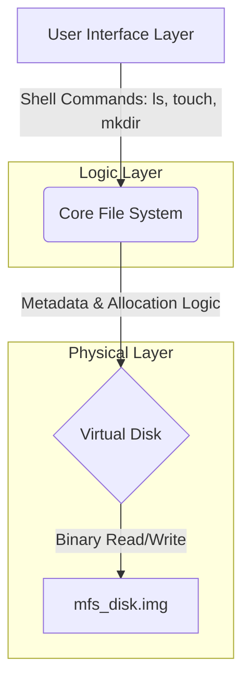

# MFS - Modular File System with Predictive Allocation

**MFS** is a research-oriented file system implementation in C. It is designed to bridge the gap between logical file abstraction and physical disk mapping by implementing proactive allocation strategies and advanced indexing.

## 📖 Abstract

Traditional file systems (like FAT) often suffer from performance degradation due to linear search times ($O(N)$) and external fragmentation. MFS addresses these "Time-Space Optimization" challenges by introducing two core architectural shifts:
1.  **Logarithmic Indexing:** Utilizing **B-Trees** to reduce file lookup time to O(log n).
2.  **Statistics Allocator:** A proactive algorithm that uses historical data to predict file growth, allocating "buffers" to prevent fragmentation before it happens.

## 🏗️ Architecture

The system is built on three distinct layers of abstraction:



1. **Physical Layer (Disk):** A virtual disk emulator (binary file) managing raw block I/O.
2. **Core Layer (Logic):** Manages the structures, Bitmap caches, and the *Statistics Allocator*.
3. **Interface Layer (Shell):** A CLI mimicking a Linux environment (`ls`, `cat`, `rm`) to interact with the system.

## 🚀 Key Features & Algorithms

### 1. The Statistics Allocator (Proactive Placement)

Unlike standard systems that split files immediately when space is tight (Reactive), MFS analyzes file write patterns. If a file is predicted to grow, the allocator reserves contiguous buffer zones ahead of time.

* **Goal:** Minimize disk head movement and I/O overhead.
* **Fallback:** An adaptive mechanism limits buffer size if predictions prove inaccurate ("Prediction Failure").

### 2. Indexing

Replaces linear linked lists with balanced trees for managing file extents.

* **Performance:** Constant/Logarithmic time access regardless of disk size.
* **Efficiency:** Uses "Extents" (Ranges) instead of mapping every single block individually, reducing Metadata size.

### 3. Safety & Resilience

* **Virtual Isolation:** Runs entirely in user space on a virtual disk image.
* **Sanitizer Integration:** Compiled with AddressSanitizer (`-fsanitize=address`) to ensure memory safety during development.

## 🛠️ Build & Installation

### Prerequisites

* **OS:** Linux or WSL (Windows Subsystem for Linux)
* **Compiler:** GCC
* **Tools:** Make

### Compilation

The project uses a `Makefile` structure. To build the system:

```bash
# Clone the repository
git clone [https://github.com/bytorbix/My-File-System.git](https://github.com/bytorbix/My-File-System.git)
cd My-File-System

# Compile the project (creates the 'mfs' executable)
make

```

### Usage

Run the file system shell:

```bash
./mfs

```

To clean up build artifacts (`.o` files and executables):

```bash
make clean

```

## 📅 Roadmap

- [x] Phase 1: Research & Theoretical Planning
- [x] Phase 2: Virtual Disk Implementation
- [/] Phase 3: Base File System Functions
- [ ] Phase 4: FS Core Logic
- [ ] Phase 5: Advanced Optimization & Algorithms
- [ ] Phase 6: Stress Testing & Performance Analysis
- [ ] Phase 7: CLI Shell & User Interface

## 📄 License

MFS is released under the MIT License. Use of this source code is governed by an MIT-style license that can be found in the LICENSE file.
